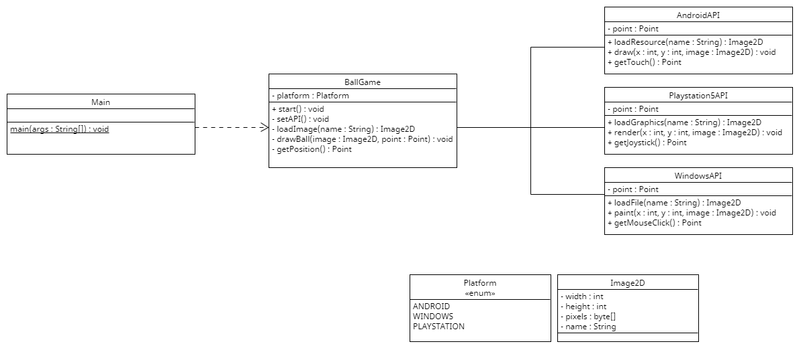

# Sesión 10. Comparativa de patrones

En esta práctica se presenta un problema que se puede utilizar con dos patrones de forma indistinta. Es un juego que se quiere compilar para diferentes plataformas. La API de cada plataforma tiene sus propios métodos con nombres distintos.

Se deben identificar todos los problemas de la solución actual y mejorar el diseño siguiendo dos caminos distintos. Como hay dos posibles soluciones se recomiendo hacer dos ramas en el repositorio para intentar una forma distinta en cada rama.

Este es el diagráma UML del código inicial:
