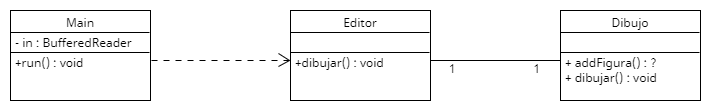

[](https://classroom.github.com/a/Gg9XbC6U)
[](https://classroom.github.com/online_ide?assignment_repo_id=16205522&assignment_repo_type=AssignmentRepo)
# Sesión 3. Editor

En esta práctica vamos a trabajar con un editor de figuras en línea de ordenes. El editor podrá tener 3 tipos de figuras:
- **Cuadrados**
    - El cuadrado se definirá con las coordenadas de la esquina superior izquierda, el ancho y el alto.
    - Para seleccionar un cuadrado habra que hacer click en un punto cuyas coordenadas x e y cumplan:
    ``` (esquina.x <= x && x <= esquina.x + ancho) && (esquina.y <= y && y <= esquina.y + alto) ```
- **Círculos**
    - El círculo se definirá con las coordenadas del céntro y su radio.
    - Para seleccionar un cuadrado habra que hacer click en un punto cuyas coordenadas x e y cumplan:
    ``` Math.sqrt(Math.pow(x - centro.x, 2) + Math.pow(y - centro.y, 2)) < radio ```
- **Triángulos**
    - El triángulo se definirá con 3 coordenadas correspondientes a los 3 vértices.
    - Para simplificar el funcionamiento del editor, un triángulo se modificará la lógica para seleccionarlo y se considerará que se selecciona sólo cuando se haga click en uno de sus vértices.

Todo el proceso de edición se simulará con órdenes en la terminal:
- La orden ```cuadrado``` comenzará el proceso de crear un cuadrado. Para crear un cuadrado habra que hacer click en un punto y soltar en otro distinto. Con esos dos puntos se obtendrán las coordenadas del vertice superior izquierdo y del tamaño que define el cuadrado.
- La orden ```circulo``` comenzará el proceso de crear un círculo. La creación del círculo será idéntica a la del cuadrado. Se hará click en un punto y se soltará en otro. El centro de los dos puntos será el centro del círculo y la distancia entre los puntos será el diámetro.
- La orden ```triangulo``` comenzará el proceso de crear un triángulo. La creación del triángulo consistirá en hacer click en 3 puntos. Cuando se haya hecho click en el tercer punto se creará el triángulo.
- La orden ```seleccionar``` volverá a la herramienta por defecto que sirve para seleccionar y mover una figura. También se volverá a esta herramienta al terminar el proceso de creación de cualquier figura. para mover una figura habrá que hacer click dentro de la figura y arrastrar la figura hasta soltar el click. La figura se desplazará lo mismo que se desplace el ratón.

Para emular las acciones del ráton hay tres órdenes: ```pulsar```, ```mover``` y ```soltar```. Todas esas 3 órdenes reciben un argumento x e y.

El código inicial de esta práctica no funciona, pero en el campus virtual tendréis un ejecutable para ver el funcionamiento del programa.

Además, en esta práctica tenéis el diagrama UML del código inicial por si es de utilidad. Podéis editar el diagrama utilizando el fichero con extensión .uxf. Se puede editar con la herramienta [UMLet](https://www.umlet.com), que dispone de versión instalable, plugins para diferentes IDEs y versión web.
