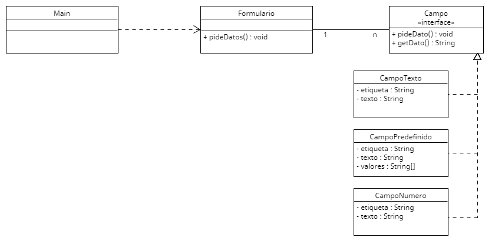

# Sesión 4. Validaciones

Esta sesión consiste en un formulario formado por diferentes campos con los que recabar información. Por el momento el formulario está compuesto por 4 campos que son validados de forma automática al introducir el dato para impedir que el usuario introduzca información incorrecta:
- *Nombre*. En el campo nombre sólo se puede introducir texto, así que fallará si se intenta añadir por ejemplo "123456".
- *Apellido*. El apellido tiene las mismas propiedades que el nombre, sólo se puede introducir texto0
- *Teléfono*. El campo del teléfono permitirá introducir sólo números.
- *Ciudad*. Para este campo habrá una lista de valores válidos que se puedan introducir. El formulario fallará si se introduce cualquier valor que no esté en la lista de valores permitido.

En todos estos validadores, cuando se introduzca un dato incorrecto y el validador falle, se le volverá a pedir el dato al usuario hasta que introduzca un valor correcto.

El código suministrado ya funciona con los campos indicados. Se pide rediseñar el código para minimizar las modificaciones que haya que hacer cuando se quieran añadir nuevos tipos de campos.

Una vez rediseñado se quieren añadir los siguientes campos:
- *Código de Producto*. Que permitirá introducir 4 caracteres (sin comprobar si sin texto o número).
- *Código Postal*. Que permitirá introducir sólo 5 dígitos.
- *Edad*. Que permitirá introducir sólo dígitos y su valor debe ser superior a 18.
- *Sueldo*. Que permitirá introducir sólo dígitos y su valos debe estar entre 800 y 1200.
- *Ubicación*. Que se podrá completar con una de las ciudades de la lista utilizada en el campo ciudad o con un código postal.
- *Código de Promoción*. En este campo hay dos posibilidades. Se puede completar con texto (sin importar su longitud) o con 3 dígitos.

Al igual que en la clase anterior, en está sesión también tenéis el diagrama UML del código inicial por si es de utilidad. Podéis editar el diagrama utilizando el fichero con extensión .uxf. Se puede editar con la herramienta [UMLet](https://www.umlet.com), que dispone de versión instalable, plugins para diferentes IDEs y versión web.
