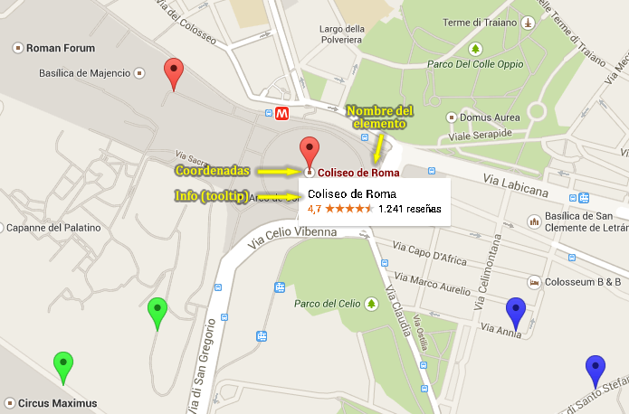
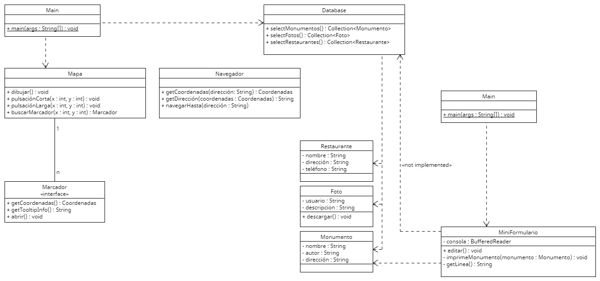

# Sesión 6. Mapa

Esta práctica imita los marcadores que se incluyen en Google Maps para marcar sitios. Por ejemplo:

En nuestra aplicación se podrán marcar 3 tipos de sitios: monumentos, fotos y restaurantes. En el código suministrado ya están esas 3 clases de modelo en el paquete *model*. También se incluye un paquete *database* con un código que simula acceder a la base de datos para recuperar la inforamación de los elementos registrados.

Nuestros marcadores no se pueden dibujar directamente sobre el mapa de Google Maps porque los elementos que se dibujen sobre el mapa deben implementar la interfaz *Marcador* que hay en el paquete *google.maps*. Esta interfaz no se puede modificar porque representa la interfaz que pide Google Maps y nosotros no podemos hacer que Google cambie su forma de representar marcadores.

El objetivo es completar el código de la clase *Main* del paquete *main* para que los datos de nuestros monumentos, restaurantes y fotos se añadan al mapa.

Como ejercicio adición se incluye el paquete formulario con un miniformulario que permitiría editar la información de monumentos. En el ejericio adicional se pide completar el diseño de esa parte para que funcione con cualquier elemento del modelo.

Al igual que en otras clases se incluye el diagrama de clases del código inicial.
