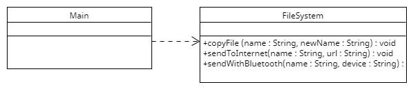

# Sesión 7. Encriptador

En esta sesión partimos de un código inicial que lee el contenido de un fichero y para copiarlo a otro, enviarlo por internet a una dirección IP o eniarlo por Bluetooth a un dispositivo cercano.

Se pide mejorar el diseño para que se puedan hacer 8 modificaciones cambiando sólo en el main:
1. Cuando se hace una copia de un fichero en disco (lo que anteriormente hacía copyFile), se quiere normalizar los saltos de línea (quitar *\r* y dejar solo los *\n*).
2. Al mandar por Internet, se quiere encriptar utilizando el [Cifrado Cesar](https://es.wikipedia.org/wiki/Cifrado_César) con valor 1 (+1 si es letra o dígito).
3. Al mandar por Bluetooth, se quiere encriptar (de igual forma que antes) y eliminar espacios repetidos.
4. Cuando se hace una copia de un fichero en disco (lo que anteriormente hacía copyFile), además de normalizar saltos de línea (quitar *\r*), hay veces que también se querrá encriptar.
5. Al enviar por Internet, además de encriptar, se quiere poder indicar si hay que normalizar (quitar *\r*) y/o eliminar espacios repetidos (una de ellas o las dos).
6. En los tres casos (tanto si se copia el fichero en disco como si se envía por Internet o Bluetooth) se quiere saber, desde el Main, el número de caracteres copiados.
7. Tanto al normalizar (quitar *\r*) como al eliminar espacios repetidos, se quiere saber también cuántos caracteres había antes del procesado.
8. Encriptar un fichero grande es una operación lenta. Se quiere que, si un mismo fichero se va a mandar tanto por Internet como por Bluetooth, se encripte solo una vez para ganar tiempo.

En esta práctica también se incluye el diagrama UML del código inicial
