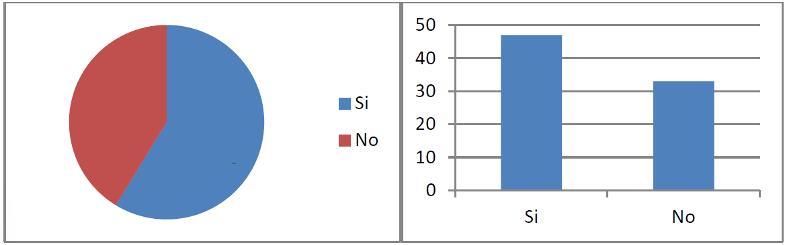
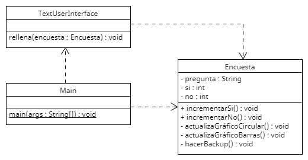

# Sesión 8. Encuestas

Se entrega la implementación de un programa que lleva la cuenta de las respuestas recibidas mediante llamadas telefónicas en una encuesta realizada por un programa de televisión en directo. Cada vez que se recibe una respuesta se actualizan ciertos gráficos que aparecen en distintas partes de la pantalla.

Se pide detectar los puntos de mejora en el diseño. Rediseñarlo usando uno o más patrones. A partir de este punto no debería tener que modificarse la clase Encuesta para realizar el resto de las modificaciones.

**NOTA**: las preguntas siempre serán de respuesta si/no (no hay que generalizar esa parte para admitir otras respuestas).

Nos van a contratar para hacer aplicaciones similares en distintos programas de televisión. Se quiere intentar aprovechar el código anterior todo lo posible. A continuación, se muestran en los siguientes puntos los requisitos que nos planean en cada uno de los nuevos programas. Hacer, por cada uno de los 5 puntos siguientes, una clase Programa{N} con su propio main (pero todas en el mismo proyecto entregado). Cada punto indica las modificaciones a realizar respecto al punto anterior (por tanto, aquello que no se mencione expresamente, quedará igual que en los puntos anteriores).

1. Para el siguiente programa de televisión quieren que, al recibir un voto, también se dibuje una línea de estado. Una línea de estado es una línea de texto que indica el número de votos de cada opción (“Nº de votos SI = ?. Nº de votos NO = ?”).
2. En otro programa de televisión no quieren que se dibuje el gráfico de barras (pero sí el circular y la línea de estado).
3. En el siguiente programa de televisión quieren que, en vez de dibujarlo con cada voto, el gráfico circular sólo se dibuje a partir del tercer voto. Es decir, se dibuja por primera vez en el voto 3 y a partir de ahí se dibuja con cada voto. La línea de estado se seguirá mostrando desde el primer voto.
4. En otro programa de televisión se quiere que vuelva a estar el gráfico de barras, pero ahora solo se dibujará cada 3 votos (con el primero, cuarto, séptimo, etc.). Los demás gráficos se seguirán dibujando como indica el punto anterior.
5. En el último programa de televisión se quiere que la línea de estado comience a imprimirse a partir del cuarto voto y a partir de ahí se muestre sólo cada dos (se imprimirá en el cuarto, sexto, octavo, etc.). Los demás gráficos se seguirán dibujando como indica el punto anterior.

El diagrama UML del código inicial es el siguiente:
